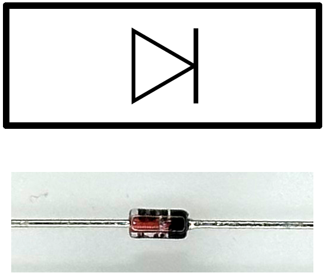
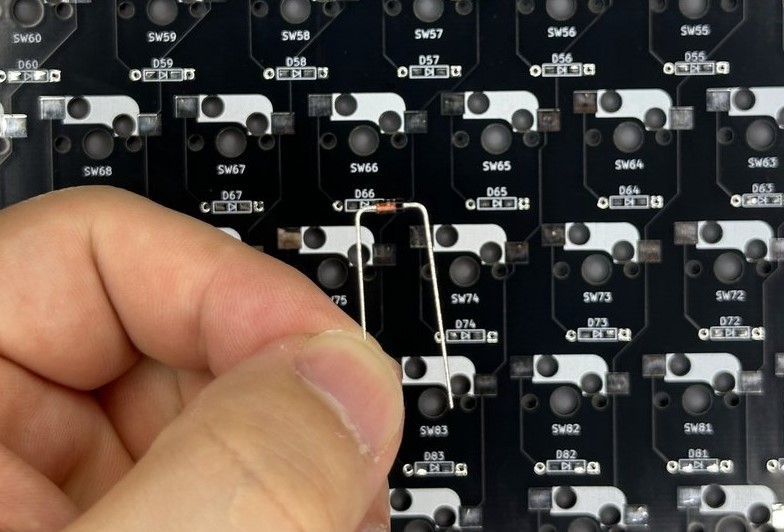
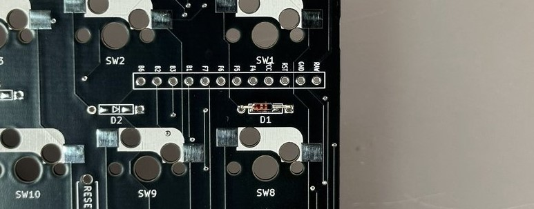
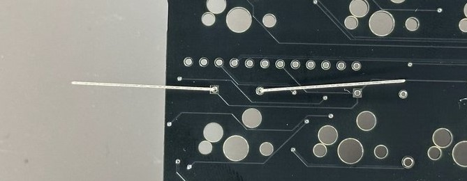
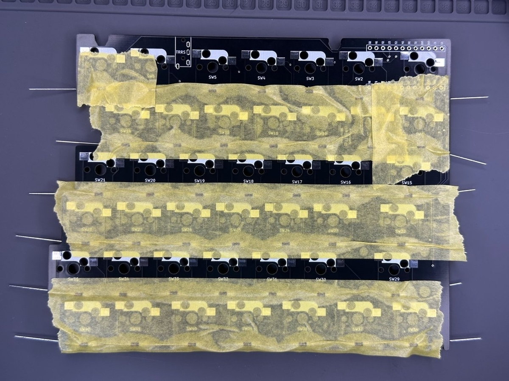
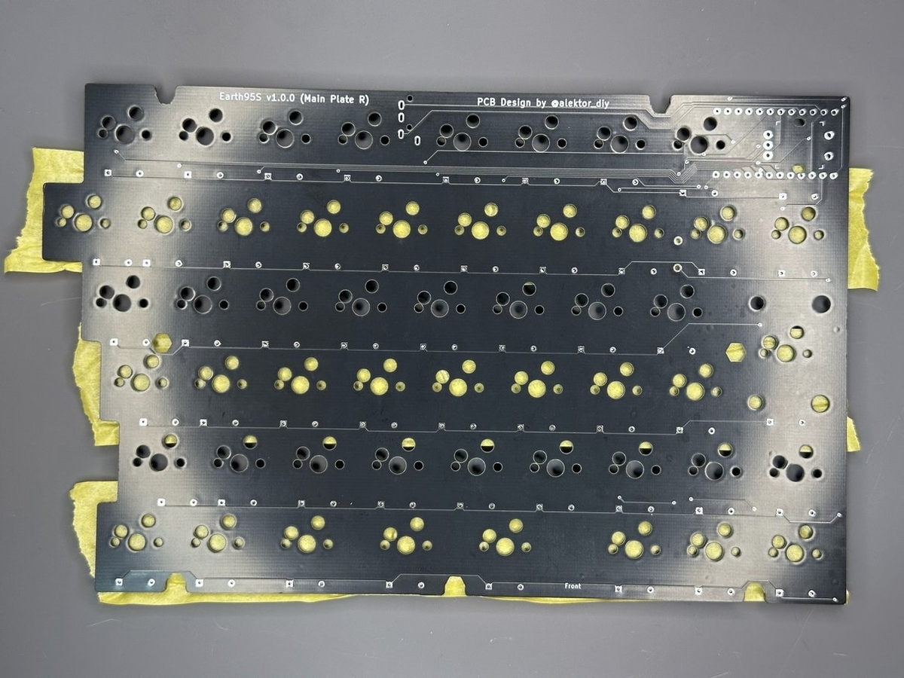
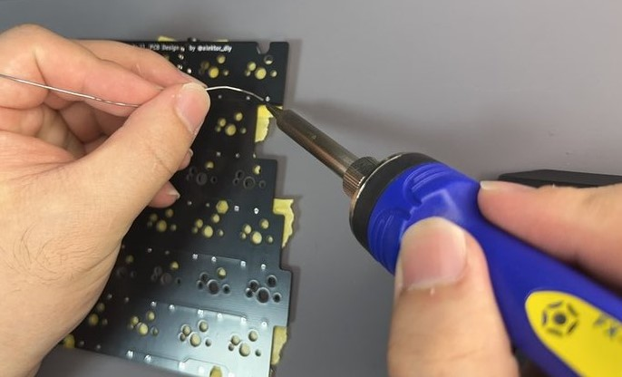
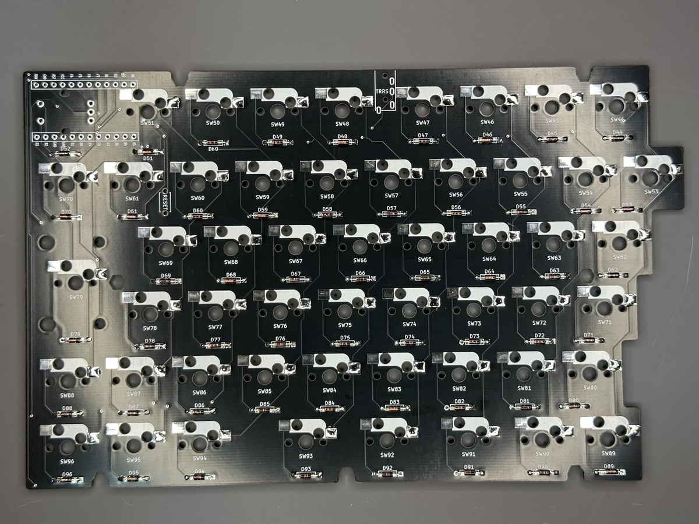

本手順はダイオード（リードタイプ）の取り付け手順です。

# 前提
## 極性
**ダイオードには極性（取り付ける向き）があります。**
基板の表示とダイオード本体をよく確認し、画像のように「ダイオードの黒い方を基板の縦線側に合わせる」向きで取り付けるようにしてください。

# 手順
ダイオードの足を折り曲げ、基板に挿し込みます。
リードベンダーなど折り曲げ工具があると便利ですが、なくても大丈夫です。
結局のところ基板に挿さればいいので、爪などで90度に折り曲げながら挿し込んでください。

こんな形に曲げればOKです。

多少ブサイクでも挿し込めれば問題ありません。

ダイオードを挿し込んだらひっくり返して、反対側から飛び出た足を広げるように折り曲げます。
足を広げることで、基板に固定することができます。

この後の工程で基板から落ちないように、ダイオードを挿し込んだ面からマスキングテープなどでダイオードを抑え、仮固定します。

基板をひっくり返し、飛び出た足を全てニッパーでカットします。
この際ニッパーで基板を傷つけないよう注意してください。

全てのダイオードの足をハンダ付けします。

全てのダイオードをハンダ付けしたらマスキングテープを剥がします。

これでダイオード（リードタイプ）の取り付けは完了です。
